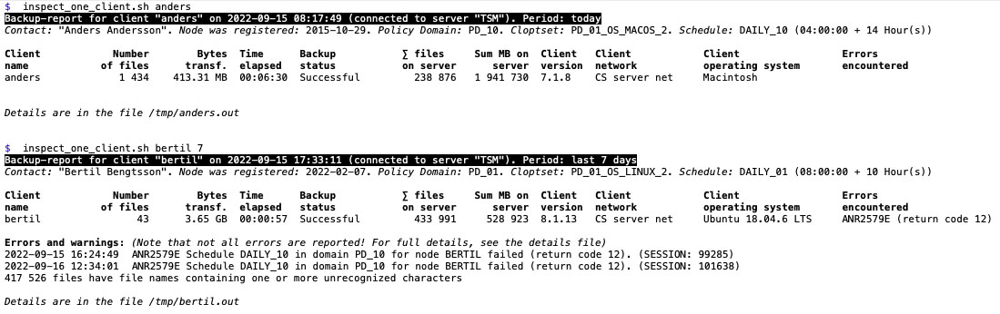
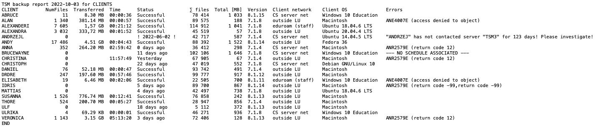

# tsm-server-report
Shell scripts reporting about backup of TSM-clients.

There are two scripts:  
`inspect_one_client.sh`  
`inspect_all_clients.sh`

The first is intended for an interactive investigation of one specific client and the other for a mass-examination of a range of clients. In the first case, a client name is required and an optional number, specifying the number of days back to examine, may be given. In the second case, a client list is required.

Both scripts are assumed to be run on the TSM server and requires a file, `tsm_secrets.env` (excluded from git), to be present in the directory of the repo. In that file, the `id` and `pwd` to be used by `dsmadmc` must be specified. It can also be a good place to put a `LANG` environment variable (I use `export LANG=sv_SE.UTF-8`).

### inspect\_one\_client.sh
It takes two parameters:

  1. Name of the client to look for
  2. How many days back to look for it. If no data is given, it starts from 00:00:00 the current day

First, the script looks for the client and warns if it isn’t found. After that, it digs for interesting information about the client and then for data from its history for the time given. 

The following is presented about the client:

  * Client name, timestamp from when the script is run, name of the TSM server and specification for time period (if any)
  * Contact Name
  * When the client was registered
  * What Policy Domain it belongs to
  * What Client Option Set (“cloptset”) is used
  * What Schedule is active and duration of that schedule

The following is presented about the history of the client for the given time period (apart from the client name):

  * Number of files, bytes transferred and time elapsed for the latest backup  
(based on `ANE4954I`, `ANE4961I` and `ANE4964I` respectively)
  * Status of the backup: if it was successful (`ANR2507I`) or not. If no backup is found, the text “NO BACKUP FOUND” is presented. If the backup has concluded but no `ANR2507I` because of a `ANR2579E (return code 12)`, the text “Conflicted” is presented
  * Total number of files and physical space occupied on the server (from `query occupancy`)
  * Date and time of the last backup (successful or not)  
_if a successful backup (`ANR2507I`)was not found during the selected time, it will be highlighted_
  * Version of the client software
  * Operating system on the client
  * Errors encoutered during the backup period
  * File names with unrecognized characters are reported separately

The details from the run is stored in `/tmp/CLIENTNAME.out`.  
More specifically: the output from `query node`, `query occupancy` and `query actlog` are stored in this file, while `query association` and `query schedule` are _not_. 

-----

Example:  

-----

### inspect\_all\_clients.sh

Currently, the script is a bit of a hack. The plan is to provide a policy domain as argument and then inspect all clients in that domain. Reports are sent via email to `$Recipient` (specified in `~/.tsm_secrets.env` or `"$ScriptDirName"/tsm_secrets.env`).

The report itself will, however, not change. Given a list of clients, it traverse that list and generate a table like report as in this example:

A number of data points are specified:

  * Client name
  * Number of file during the last backup session (`ANE4954I`)
  * Total number of bytes transferred (`ANE4961I`)
  * Elapsed processing time (`ANE4964I`)
  * State: successful or not. If the client hasn’t had any communication with the server in >30 days, a special warning about that is given
  * Physical Space Occupied on the server (in total)
  * Number of Files on the server (in total)
  * Version of the client software on the client computer
  * From what network the last client access occurred
  * What operating system the client is using
  * Errors. During the years, we have seen the following errors and thus warns for them:
    * No schedule associated
    * Access denied to object ([`ANE4007E`](https://www.ibm.com/docs/en/spectrum-protect/8.1.13?topic=list-ane4000e#ANE4007E))
    * Return code ([`ANR2579E`](https://www.ibm.com/docs/en/spectrum-protect/8.1.13?topic=list-anr0010w#ANR2579E))
    * Invalid password submitted ([`ANR0424W`](https://www.ibm.com/docs/en/spectrum-protect/8.1.13?topic=list-anr0010w#ANR0424W))
    * Object contains unrecognized characters ([`ANS4042E`](https://www.ibm.com/support/pages/ans4042e-unrecognized-characters-during-backup-data-linux-clients))

_Note that there may be other error messages that may be relevant to look for!_
