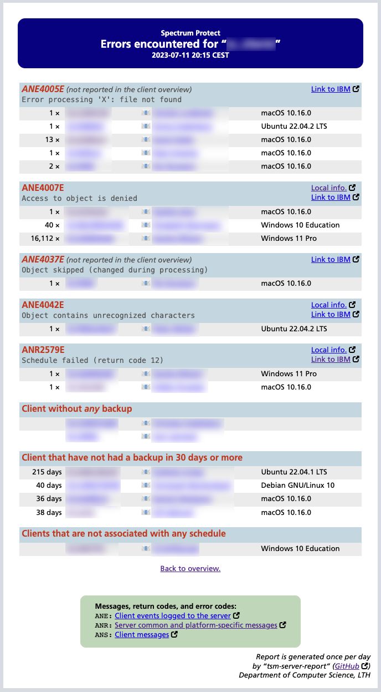

# tsm-server-report
Linux shell scripts reporting about backup of TSM-clients.

There are two scripts:  
`inspect_one_client.sh`  
`inspect_domain.sh`

The first is intended for an interactive investigation of one specific node. A node name is required and an optional number, specifying the number of days back to examine, may be given.

The second script examines all clients in a given policy domain (required parameter). The script produces a web page for the clients in the domain and also a file for every client – see examples below. This script is intended to be consumed by admins and end-users alike. The overview web page is sent by email to a given recipient and the generated files may be published 
on a web server.  
An error-page is also generated containing _all_ errors that have occurred; the overview-report from `inspect_domain.sh` only contains the most common errors. This error-report is (currently) not send by email but only uploaded to a web page – if upload is selected. The error report creates clickable email links with descriptions for the errors encountered. 

Both scripts are assumed to be run on a linux client with an installed client (or rather, the `dsmadmc` binary) and requires a file, `tsm_secrets.env` (excluded from git; details below). 
In that file, the `id` and `password` to be used by `dsmadmc` must be specified. The file can reside in the project directory or in the user home directory.

The scripts look for errors `ANE4007E`, `ANR2579E`, `ANR0424W` and `ANE4042E` and notify the user about them. The selection is used on the simple reason that those are the errors we most 
commonly see. A more robust, and general, solution might be developed in the future.

## inspect\_one\_client.sh
It takes two parameters:

  1. Name of the client to look for
  2. How many days back to look for it. If no data is given, it starts from 00:00:00 the current day

First, the script looks for the client and warns if it isn’t found. After that, it digs for interesting information about the client and then for data from its history for the time given. 

The following is presented about the client:

  * Client name, timestamp from when the script is run and specification for time period (if any)
  * Information about the node
  * information about the backup for the specified time period

The details from the run is stored in `/tmp/CLIENTNAME.out`.  
More specifically: the output from `query node`, `query occupancy` and `query actlog` are stored in this file, while `query association` and `query schedule` are _not_. 

-----

Examples:  
  

-----

## inspect\_domain.sh

This script takes as argument a space separated list of one or more policy domains and builds a list of clients that are associated with those domains.  
This list of clients is traversed and information (specified below) is gathered and three reports are created:
  1. a web page as in _example 1_ below, listing all client in the domain. This is intended to be viewed by admins and end users alike
  2. a web page for each client, see _example 2_
  3. a web page containing all errors, see _example 3_

If a given domain is not valid, it will be noticed as such. If a client is present in multiple domains, it will be processed only once. The list of clients is processed alphabetically. The 
table is bort sortable and searchable.

### tsm_secrets.env

The script *requires* a file, `~/.tsm_secrets.env` or `"$ScriptDirName"/tsm_secrets.env`, containing the following:  
| Key                                                  | Explanation |
|------------------------------------------------------|--------------|
| `export ID=sp-user`                                  | User name for `dsmadmc` |
| `export PASSWORD='secret_password'`                  | Password for that user |
| `RECIPIENT="recipient@my.domain"`                    | Email address to send the completed report to |
| `export OC_SERVER="server.url.edu:portnumber"`       | URL for the Operations Server (for the report only) |
| `export SCP=true`                                    | If the report is supposed to be transferred to another system |
| `export SCP_HOST=webb.server.org`                    | ...and the DNS-name for that system |
| `export SCP_DIR=/path/to/web/dir/`                   | ...as well as directory |
| `export SCP_USER=username`                           | ...and user name to log in as (using stored ssh-keys) |
| `export PUBLICATION_URL="https://com.url.edu/path"`  | URL for the finished report (included in the email) |
| `export STORAGE_POOL="STORAGE_POOL_1"`               | Given this, size and usage of the Storage Pool will be presented |

### Error reporting

The file `sp_errors.txt` is required for the error report. It consists of a number of rows with the following content:  
`Message Code` `|` `DISREGARD` or `VALID` `|` `Explanation` `|` `URL to IBM` `|` `URL to our own page regarding the error`  
Lines marked woth `DISREGARD` will be disregarded for presentation. I find it useful, however, to _know_ what I am disregarding.

The script gets the contact name and email address for the nodes and creates a clickable email link with some basic information about the error that can easily be sent to the user.

Also note that the IBM-links contain the text `SERVERVER`: it will be replaced with the actual version the server in question is running (such as `8.1.16`).

Here are two example lines from `sp_errors.txt`:  
`ANR8601E|DISREGARD|During the SSL handshake, the certificate exchanged between the server and remote host XX was not validated||`  
`ANR2579E|VALID|Schedule 'SCHEDULE' in domain 'DOMAIN' for node XX failed (return code 12)|https://www.ibm.com/docs/en/spectrum-protect/SERVERVER?topic=list-anr0010w#ANR2579E|https://fileadmin.cs.lth.se/intern/backup/ANR2579E.html`

-----

### Examples

Example 1. A web page with the report of the entire domain:

Example 2. A web page reporting a single node:

Example 3. The error report page: 

Example 4. A sample email from the error report:

