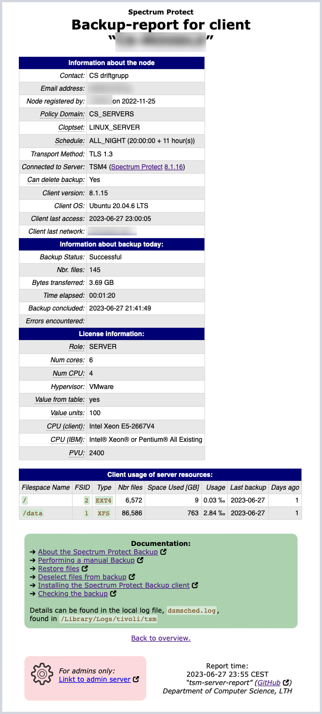

# tsm-server-report
Linux shell scripts reporting about backup of TSM-clients.

There are two scripts:  
`inspect_one_client.sh`  
`inspect_all_clients.sh`

The first is intended for an interactive investigation of one specific. A client name is required and an optional number, specifying the number of days back to examine, may be given.  
The second script examines all clients in a policy domain (required parameter). The script produces a web page for the clients in the domain and also a file for every client – see examples below. The overview web page is sent by email to a given recipient and the generated files may be published on a web server. 

Both scripts are assumed to be run on a linux client with an installed client (or rather, the `dsmadmc` binary) and requires a file, `tsm_secrets.env` (excluded from git). In that file, the `id` and `password` to be used by `dsmadmc` must be specified. The file can reside in the project directory or in the user home directory.

### inspect\_one\_client.sh
It takes two parameters:

  1. Name of the client to look for
  2. How many days back to look for it. If no data is given, it starts from 00:00:00 the current day

First, the script looks for the client and warns if it isn’t found. After that, it digs for interesting information about the client and then for data from its history for the time given. 

The following is presented about the client:

  * Client name, timestamp from when the script is run and specification for time period (if any)
  * Information about the node
    * Contact
    * email address
    * when, and by whom, the node was registered
    * policy domain
    * cloptset
    * schedule
    * transport method
    * name of the TSM server
    * info if the client can delete it's backups
    * client version
    * client OS
    * date and time for last client access
    * from what network the client communicated
  * information about the backup for the specified time period
    * Status of the backup: if it was successful (`ANR2507I`) or not. If no backup is found, the text “NO BACKUP FOUND” is presented. If the backup has concluded but no `ANR2507I` because of a `ANR2579E (return code 12)`, the text “Conflicted” is presented
    * Number of files, bytes transferred and time elapsed for the latest backup  
(based on `ANE4954I`, `ANE4961I` and `ANE4964I` respectively)
    * Total number of files and physical space occupied on the server (from `query occupancy`)
    * Date and time of the last backup (successful or not)  
_if a successful backup (`ANR2507I`)was not found during the selected time, it will be highlighted_
    * Time elapsed for the last backup
    * Errors encoutered during the backup period
    * File names with unrecognized characters are reported separately
  * client usage of server resources for all file spaces that are present on the server is reported with the following details:
    * Filespace name
    * FSID
    * File system type
    * Number of files
    * Space occupied (physical space occupied; logical space is used idf deduplication is used)
    * Last backup, both date and number of days ago

The details from the run is stored in `/tmp/CLIENTNAME.out`.  
More specifically: the output from `query node`, `query occupancy` and `query actlog` are stored in this file, while `query association` and `query schedule` are _not_. 

-----

Examples:  
  

-----

### inspect\_all\_clients.sh

This script takes as argument a space separated list of one or more policy domains and builds a list of clients that are associated with those domains.  
This list of clients is traversed and information (specified below) is gathered and two reports are created:
  1. a web page as in _example 1_ below, listing all client in the domain(s)
  2. a web page for each client, see _example 2_

If a given domain is not valid, it will be noticded as such. If a client is present in multiple domains, it will be processed only once. The list of clients is processed alphabetically. 

The script *requires* a file, `~/.tsm_secrets.env` or `"$ScriptDirName"/tsm_secrets.env`, containing the following:  
| Key                                                 | Explanation |
|-----------------------------------------------------|--------------|
| `export ID=sp-user`                                 | User name for `dsmadmc` |
| `export PASSWORD='secret_password'`                 | Password for that user |
| `RECIPIENT="recipient@my.domain"`                   | Email address to send the completed report to |
| `export OC_SERVER="server.url.edu:portnumber"`      | URL for the Operations Server (for the report only) |
| `export SCP=true`                                   | If the report is supposed to be transferred to another system |
| `export SCP_HOST=webb.server.org`                   | ...and the DNS-name for that system |
| `export SCP_DIR=/path/to/web/dir/`                  | ...as well as directory |
| `export SCP_USER=username`                          | ...and user name to log in as (using stored ssh-keys) |
| `export PUBLICATION_URL="https://com.url.edu/path"` | URL for the finished report (included in the email) |
| `export STORAGE_POOL="STORAGE_POOL_1"`              | Given this, size and usage of the Storage Pool will be presented |

Example 1:  
_(Please note that the columns are sortable)_

Example 2:

